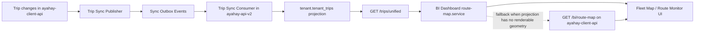
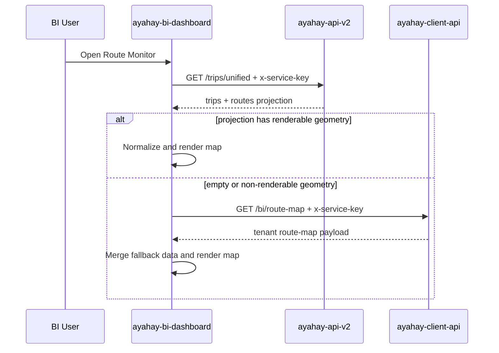

# BI Dashboard Trip Sync and API Integration Guide

**System:** Ayahay BI Dashboard  
**Repository:** `ayahay-bi-dashboard`  
**Related Services:** `ayahay-api-v2`, `ayahay-client-api`  
**Last Updated:** April 15, 2026

---

## 1. Purpose of This Document

This document explains the **full implementation of the new trip syncing architecture used by the BI Dashboard**, especially for the Route Map / Route Monitor views.

It covers:

- why the new sync flow was introduced
- which service is now the source of truth for reads and writes
- how trip data moves from the operational API into the BI dashboard
- how tenant safety is enforced
- how the BI dashboard fetches and renders the data
- what fallback behavior exists when local data is incomplete or a projection is not ready

---

## 2. Problem the New Sync Solves

Previously, BI behavior could become inconsistent because:

1. route data and trip data were being assembled from different places
2. BI sometimes needed to do merging logic on the frontend side
3. stale or missing projection data caused empty route maps or mismatched route counts
4. tenant scoping was too easy to misuse if it depended on client-provided tenant identifiers

The new design fixes that by making the flow:

- **write-side source of truth:** `ayahay-client-api`
- **read-side unified projection for BI:** `ayahay-api-v2`
- **visualization consumer:** `ayahay-bi-dashboard`

This means the BI dashboard now reads from a **single tenant-safe hub endpoint** and only uses the tenant BI route endpoint as a **fallback** when geometry is unavailable.

---

## 3. High-Level Architecture



### Responsibilities per service

| Service | Responsibility |
|---|---|
| `ayahay-client-api` | Owns trip writes and emits sync events when trips change |
| `ayahay-api-v2` | Consumes those events, stores a tenant-safe read projection, and exposes the unified BI endpoint |
| `ayahay-bi-dashboard` | Fetches unified route-map data and renders routes, ports, vessels, and status |

---

## 4. Source of Truth Model

### Write Side

Trip mutations still happen in `ayahay-client-api`.

Whenever a trip is:

- created
- updated
- cancelled
- reassigned to another vessel
- deleted
- status-changed

…the service publishes a sync payload into the outbox for `api-v2`.

### Read Side

The BI dashboard should now prefer the unified route endpoint exposed by `ayahay-api-v2`:

```http
GET /trips/unified
```

This endpoint is now the **primary BI read model** for route map consumers.

---

## 5. Tenant Security Model

A major design goal of the new implementation is **strict tenant isolation**.

### Old risk

Older approaches could allow the client to pass a tenant identifier directly in the request, which is unsafe for a shared multi-tenant BI deployment.

### New behavior

The unified endpoint uses:

- `x-service-key` header
- tenant resolution from the authenticated service context
- explicit rejection of request-side tenant override

### Important rule

The BI dashboard should **not** choose the tenant by manually sending `tenant_id` for the unified route-map request.

Instead:

1. the BI tenant context provides the active tenant service key
2. the dashboard sends that key in the header
3. the backend guard resolves the tenant from the key
4. the API returns only that tenant’s projection

---

## 6. End-to-End Sync Lifecycle

## 6.1 Trip Change Happens in Client API

In `ayahay-client-api`, trip operations trigger the sync publisher.

Key implementation idea:

- a trip is read from the operational views/tables
- the service builds a canonical payload
- route path geometry is included when available
- the payload is written to the outbox with event type `CREATE`, `UPDATE`, or `DELETE`

### Payload includes

- trip id
- reference number
- route id / route code / route name
- vessel / ship details
- source and destination ports
- scheduled and actual departure / arrival times
- canonical trip status
- booking settings and capacities
- route path coordinates
- route path distance in nautical miles
- timestamps and deletion markers

This is the critical step that makes the BI layer receive data that is already normalized.

---

## 6.2 Event Is Consumed by API V2

`ayahay-api-v2` receives the trip sync event through its trip sync consumer.

The consumer then:

1. resolves the tenant of the event
2. checks if the event was already processed
3. inserts or updates the tenant projection row
4. deletes the projection row if the event type is `DELETE`
5. records the event as consumed to prevent duplicates

This is what keeps the BI read model fresh without requiring BI to manually merge multiple sources.

---

## 6.3 Projection Table Used for BI Reads

The unified read model is stored in the `tenant.tenant_trips` table.

This projection stores the fields BI needs for route rendering and schedule display, including:

- route name
- vessel name
- trip timing
- canonical status
- source / destination port information
- saved route path coordinates
- distance values

This projection exists specifically so BI reads are:

- tenant-scoped
- fast
- predictable
- decoupled from operational write logic

---

## 6.4 Fallback Pull Job

If Redis or the preferred transport is unavailable, `ayahay-api-v2` also has a fallback polling job.

That job periodically:

- finds eligible tenants
- pulls trip events from the producer service
- processes them one by one
- acknowledges success or failure back to the producer

This makes the synchronization more resilient in local or partial environments.

---

## 7. Unified API Contract Used by BI

Primary endpoint:

```http
GET /trips/unified?date=YYYY-MM-DD&include=liveStatus,routePath
x-service-key: <tenant service key>
```

### Why this endpoint matters

This endpoint returns both:

- `trips` for the requested date
- `routes` for the tenant

That allows the BI dashboard to show:

- routes even if there is no active trip for that route on the selected date
- trip markers only for trips active on the selected date
- geometry and port information in one normalized response

### Response envelope

```json
{
  "trips": [...],
  "routes": [...]
}
```

In some flows the payload may be wrapped as:

```json
{
  "status": "success",
  "message": "Request successful",
  "data": {
    "trips": [...],
    "routes": [...]
  }
}
```

The BI service layer now normalizes both shapes safely.

---

## 8. How the BI Dashboard Calls the API

The integration entry point in the BI dashboard is the route-map service.

### Main fetch sequence

1. BI resolves the active tenant from the dashboard context
2. BI gets the tenant service key
3. BI calls the primary unified endpoint on `ayahay-api-v2`
4. BI normalizes the payload whether it is wrapped or direct
5. BI checks whether the response contains renderable geometry
6. if geometry is missing or the projection is empty, BI falls back to the tenant route-map endpoint in `ayahay-client-api`

### Primary fetch target

The dashboard constant now points route-map loading to:

```ts
ROUTE_MAP: "/trips/unified"
```

So the default BI route map request uses the hub service rather than directly depending on the client BI API.

---

## 9. Fallback Strategy in the BI Dashboard

The fallback behavior is intentional and important.

### Primary source

`ayahay-api-v2` unified route-map endpoint.

### Fallback source

`ayahay-client-api` route-map endpoint:

```http
GET /bi/route-map
```

### When fallback is used

Fallback is used when:

- the primary endpoint is unreachable
- the primary endpoint returns no routes and no trips
- the primary endpoint returns records but no renderable geometry

### Why fallback exists

This helps BI remain usable while:

- migrations are still being repaired locally
- the projection is still warming up
- geometry data is missing in the projection but available in the tenant API

This fallback behavior was added specifically to prevent blank route maps during transition.

---

## 10. How the Route Map UI Builds the Display

The main visualization logic lives in the fleet map component.

### Inputs it consumes

- `apiTrips` from the unified response
- `apiRoutes` from the unified response
- current selected date
- selected route state
- show-all state
- tenant context

### What it builds

The component transforms the API data into three UI structures:

| UI Structure | Purpose |
|---|---|
| `DEFINED_ROUTES` | full route definitions with names, geometry, ports, and distance |
| `ROUTE_LIST` | compact list used in the sidebar |
| `apiVessels` | animated vessel marker objects derived from trip timing and status |

### Rendering behavior

- route lines are rendered from route coordinates
- port markers are rendered from source / destination coordinates
- vessel icons are animated along the line according to trip status and time
- hover state shows live trip information
- sidebar selection focuses the route in the map

---

## 11. Selected Route vs Show All Behavior

The route monitor now follows this rule:

### Selected route mode

When a user selects a specific route:

- only that route should appear
- only that route’s relevant markers should appear
- if that route has no usable geometry, nothing should be shown for the path

### Show All mode

When the user switches back to show all:

- all available route paths can be shown
- all available ports can be shown
- labels should remain visible and consistent

This logic was refined so the UI no longer incorrectly mixes or loses labels after toggling between focused mode and show-all mode.

---

## 12. Route and Port Geometry Rules

The dashboard can render a route if at least one of the following is true:

1. the route already has `route_coords`
2. both source and destination ports have valid latitude/longitude

If neither exists, the dashboard cannot draw the path.

### Important operational note

If a route still does not appear after the sync logic is working, the usual reason is **data completeness**, not frontend failure.

Typical missing data causes:

- no saved row in `client.route_paths`
- source or destination port has null latitude/longitude
- projection was updated but there is still no geometry to render

---

## 13. Live Status, Animation, and KPI Mapping

For each trip returned by the API, the BI dashboard derives:

- route progress
- vessel position along the sea path
- ETA display
- boarded passengers vs total seats
- utilization percentage
- route annual revenue placeholder / value

### Status normalization used in BI

The sync flow translates operational statuses into stable canonical values such as:

- `SCHEDULED`
- `BOARDING`
- `DEPARTED`
- `ARRIVED`
- `CANCELLED`

This simplifies dashboard rendering logic because the UI can rely on a smaller, cleaner state model.

---

## 14. Why the New Sync Is Better Than the Old BI Approach

| Old Pattern | New Pattern |
|---|---|
| BI had to infer or merge behavior from multiple sources | BI uses a unified hub endpoint first |
| Route map could become stale or inconsistent | Trip changes are pushed into a projection via sync events |
| Tenant scoping could be misused by request params | Tenant identity comes from service-key authentication |
| Empty projection could blank the map | BI now has a controlled fallback to the tenant route-map API |
| Different response shapes caused frontend bugs | Response normalization now safely unwraps both direct and nested payloads |

---

## 15. File-by-File Implementation Summary

### In `ayahay-client-api`

#### Trip sync publishing

- publishes create/update/delete trip events
- includes route and vessel metadata
- resolves saved or computed route path geometry before sending

#### BI route-map endpoint

- still exists as a tenant-local source
- used as the fallback endpoint for BI during transition or missing hub geometry

---

### In `ayahay-api-v2`

#### Unified route-map endpoint

- path: `GET /trips/unified`
- protected by service-key guard
- explicitly rejects tenant override attempts
- returns both `trips` and `routes`

#### Trip projection storage

- `tenant.tenant_trips` is the BI read projection
- optimized for date and status access

#### Sync consumers and resilience

- processes outbox events from producer tenants
- supports duplicate protection
- supports fallback pull mode when needed

---

### In `ayahay-bi-dashboard`

#### Route-map service

- fetches from the unified hub endpoint first
- normalizes response shape
- detects whether geometry is renderable
- falls back to the client BI endpoint when needed

#### Fleet map component

- converts API payload into routes, vessels, and port markers
- renders the route monitor sidebar and map
- applies selected-route and show-all behaviors
- keeps labels visible for shared ports and route toggles

---

## 16. Request Sequence from BI Dashboard to API



---

## 17. Operational Notes for Developers

### When everything is healthy

Expected behavior:

- trip updates in the operational system eventually appear in BI
- route monitor loads from the unified hub endpoint
- BI can show routes even when there are no trips for some routes
- selected route mode shows only the chosen route
- show-all mode shows all available routes with stable port labels

### When data still does not appear

Check these in order:

1. Is the BI request sending the correct service key?
2. Is `ayahay-api-v2` running the unified endpoint?
3. Does the tenant projection contain rows for the selected date?
4. Are port latitude/longitude values populated?
5. Are there saved route-path records for the route pair?
6. Is BI using fallback because the primary response has no renderable geometry?

---

## 18. Known Current Limitations

The sync implementation is correct, but the map still depends on real tenant data quality.

If a route has:

- no saved route path
- no source/destination coordinates

…then the dashboard has nothing to draw for that path even if the sync itself is working.

So the final display quality depends on both:

- correct synchronization architecture
- complete route and port geometry data

---

## 19. Summary

The new BI sync implementation works as follows:

1. `ayahay-client-api` remains the trip write owner
2. every trip mutation publishes a sync event
3. `ayahay-api-v2` consumes that event and updates `tenant.tenant_trips`
4. the BI dashboard reads from `GET /trips/unified` using the tenant service key
5. the dashboard falls back to `GET /bi/route-map` only when necessary
6. the map transforms the response into route paths, port markers, vessel markers, and route sidebar state

This architecture removes BI-side data merging, improves tenant safety, and makes the route monitor more stable and easier to maintain.

---

## 20. Recommended Future Improvements

- fully stabilize and repair migration history for local development
- backfill missing port coordinates for incomplete tenants
- backfill missing `client.route_paths` records for routes without geometry
- expose a lightweight health endpoint for projection freshness monitoring
- add an integration test that verifies the unified response shape used by the BI dashboard

---

**Documentation owner:** BI / Platform integration workstream
